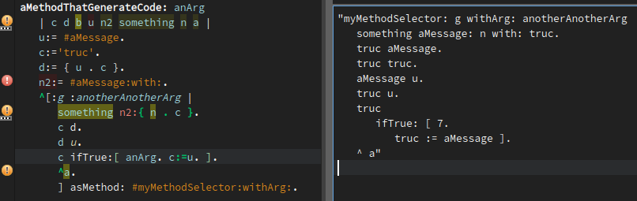
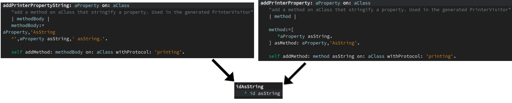
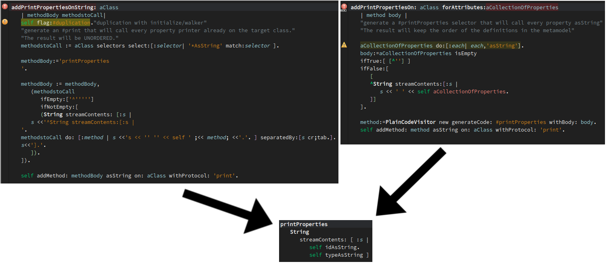

# PlainCode

[

Able to generate methods using the pharo syntax in a block rather than strings, or complex node writting.  The variables used in the environment will be replaced by their values if they are set. You can also pass a dictionary to rename the arguments of the nodes.

Two main hooks with the same behavior are available for now:
PlainCodeVisitor >>> generateCode: aSelector withBody: aBlock \[ andArguments: aDictionary\]
BlockClosure >>> asMethod: aSelector withArguments: aDictionary
(see examples bellow)

There's a representative example of the syntax we're constrained with:

/!\ Uses the context the block has been defined in, meaning that you cannot create the target block in another block that will be valued in another context. Use #ifTrue:ifFalse and variants if you need control flow (they are inlined at compilation time, so no context change).  
We also (sadly) have to stringify the AST rather than giving it directly to the compiler, because the replacement are pretty rudimentary, and don't analyze a lot of things (such as replaced values that are instance variables of the targeted class).

Unit tests show some more small examples. Here's some bigger ones from another project.

